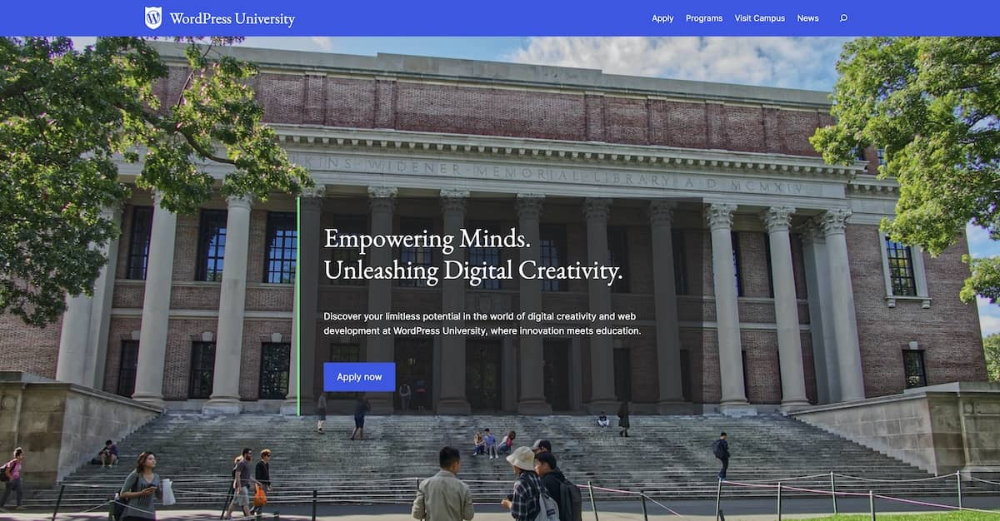

# Workshop: WordPress University

Welcome to the "WordPress University" workshop, where you will be guided through a 12-step process to create a website for the fictitious WordPress University. This hands-on workshop offers a comprehensive overview of the fundamentals of building with blocks and block themes, providing valuable insights and practical experience in a straightforward and engaging website-building project.

## Steps

> **Note** This workshop is designed to be instructor led. The instructions alone are not comprehensive.

- [Step 1: Getting set up](/steps/step-1/readme.md)
- [Step 2: Exploring the Site Editor](/steps/step-2/readme.md)
- [Step 3: Introduction to theme.json](/steps/step-3/readme.md)
- [Step 4: Layout, Columns, Covers, and Groups](/steps/step-4/readme.md)
- [Step 5: Query Loops](/steps/step-5/readme.md)
- [Step 6: Block styles](/steps/step-6/readme.md)
- [Step 7: Block variations](/steps/step-7/readme.md)
- [Step 8: Templates & Template Parts](/steps/step-8/readme.md)
- [Step 9: Patterns](/steps/step-9/readme.md)
- [Step 10: Custom CSS in block themes](/steps/step-10/readme.md)
- [Step 11: Block and template locking](/steps/step-11/readme.md)
- [Step 12: Client-side filters](/steps/step-12/readme.md)

Each step folder contains a `readme.md` file that provides instructions. The folder also contains a `/theme` folder, which contains the complete theme at end of each step.

