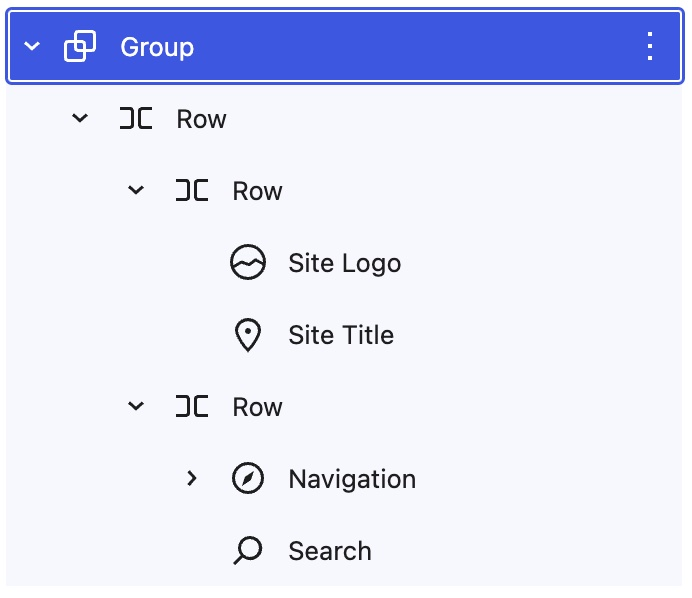
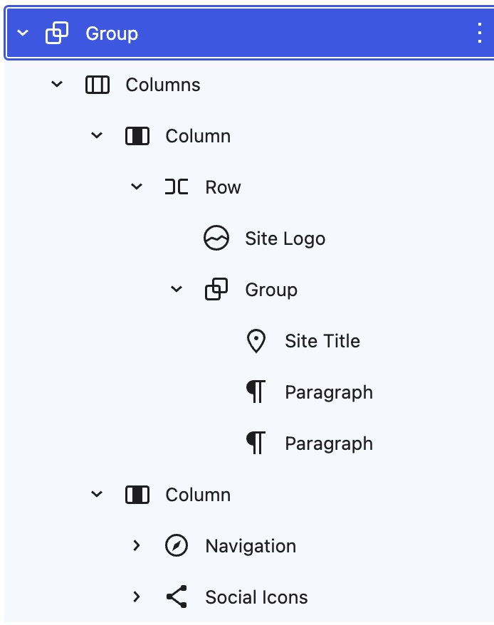

# Step 4: Columns, Groups, Rows, and Stacks 

## 1. Setup
1. Create a new page titled "Designs".

## 2. Design the site header

1. Design the site header using the following composition:
	- Site Logo image width is `32px`
	- Site Title has a `Large` font size
	- Outer Row block has `wide` width
	- Group container has a `Primary` background, top/bottom padding of `0.85rem`, and right/left padding of `2`.
	- Search block uses "Button only" styling

### 3. Design the site footer

1. Design the site header using the following composition:
	- Site Logo image width is `100px`
	- Site Title has a `Large` font size
	- Paragraphs are `Small` and `Extra Small`
	- Outer Columns block has `wide` width
	- Group container has a `Primary` background, top/bottom padding of `4`, and right/left padding of `2`
	- The Social Icons block is set to "Logos Only"

	

## Resources
- 

---
#### [← Previous](/steps/step-2/readme.md) ... [Next →](/steps/step-4/readme.md)

