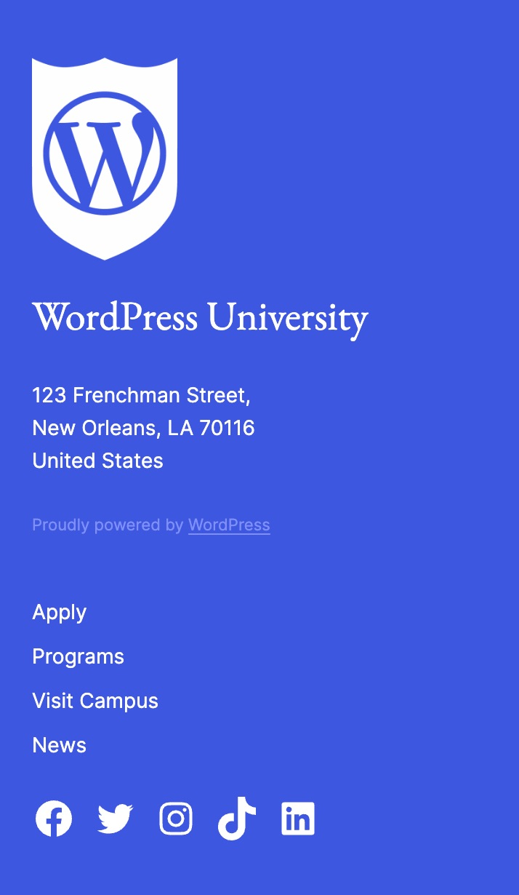

# Step 4: Columns, Groups, Rows, and Stacks 

## 1. Setup
1. Create a new page titled "Block Designs". Leave it empty for now. 
2. In the theme folder, create a `functions.php` file.
2. We will be adding some custom CSS later in this Step. For this custom CSS to work properly, enqueue the theme's stylesheet (`style.css`) by adding the following code to the `functions.php` file:
```php
<?php

function wpu_setup() {

    // Enqueue editor styles.
    add_editor_style( 'style.css' );
}
add_action( 'after_setup_theme', 'wpu_setup' );

function wpu_enqueue_scripts() {

	// Register theme stylesheet.
	wp_register_style(
		'wpu-styles',
		get_template_directory_uri() . '/style.css',
		array(),
		wp_get_theme()->get( 'Version' ),
	);

	// Enqueue theme stylesheet.
	wp_enqueue_style( 'wpu-styles' );
}
add_action( 'wp_enqueue_scripts', 'wpu_enqueue_scripts' );
```

## 2. Design the site header


1. On the "Block Designs" page, design the site header using the following composition (not a complete list):
	- Use the [WordPress University - Logo.png](/assets/logos/WordPress%20University%20-%20Logo.png) file for the Site Logo.
	- Site Logo image width is `32px`.
	- Site Title has a `Large` font size.
	- Outer Row block has a `wide` width.
	- Group container has a `Primary` background, top/bottom padding of `0.85rem`, and right/left padding of `2`.
	- Search block uses "Button only" styling.


### 3. Design the site footer


1. Design the site header using the following composition (not a complete list):
	- Site Logo image width is `100px`.
	- Site Title has a `Large` font size.
	- Paragraphs are `Small` and `Extra Small`.
	- Outer Columns block has a `wide` width.
	- Group container has a `Primary` background, top/bottom padding of `4`, and right/left padding of `2`.
	- The Social Icons block is set to "Logos Only".

	
2. On mobile, the right column should appear first. This will require some custom CSS. Add the custom CSS class `is-style-mobile-reverse-order` to the Columns block. In the theme's `style.css` file, add the following code: 
```css
/* Reverse column order on mobile in the Columns block. */
@media (max-width: 781px) {
    .wp-block-columns.is-style-mobile-reverse-order {
        flex-direction: column-reverse;
    }
}
```
3. The content of the right column should also be aligned left on mobile. This will also require some custom CSS. Add the custom CSS class `is-style-mobile-content-align-left` to the right Column block. In the theme's `style.css` file, add the following code:
```css
/* Align content in a Column block left on mobile. */
@media (max-width: 781px) {
    .wp-block-column.is-style-mobile-content-align-left {
        text-align: left;
    }

    .wp-block-column.is-style-mobile-content-align-left * {
        align-items: flex-start !important;
        justify-content: flex-start !important;
    }
}
```
4. Confirm that the footer appears correctly on mobile. 



### 4. Design the site homepage banner


1. Design the site homepage banner using the following composition (not a complete list):
	- Cover is full width and has a minimum height of `100vh`.
	- Cover has padding set to `0`.
	- Group has a background color of `#1E1E1EB3`.
	- Group has a left border width of `4px` in `Quaternary`.
	- Group has padding and block spacing set to `3`.

	

## Resources
- [Builder Basics: Building with Columns, Groups, Rows and Stacks](https://wordpress.tv/2022/12/02/builder-basics-building-with-columns-groups-rows-and-stacks/)

---
[← Previous](/steps/step-3/readme.md) &nbsp;&nbsp;|&nbsp;&nbsp; [Next →](/steps/step-5/readme.md)


