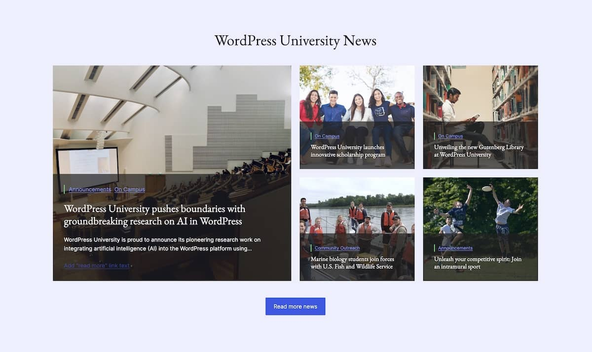
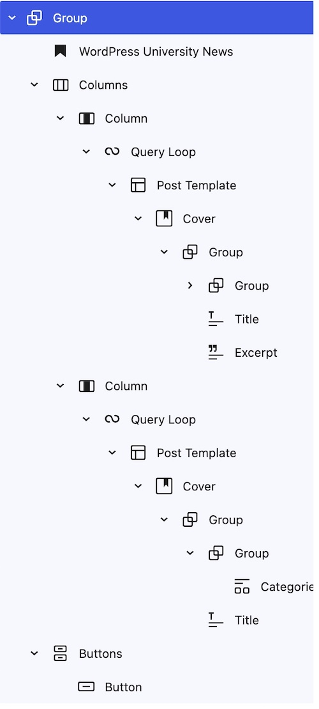

# Step 7: Query Loops

## Steps

### 1. Design a "University News" block layout


1. Design the "University News" block layout (not a complete list):
    - Use a Columns block with two columns of equal width. 
    - Place a Query loop block in each column
    - For each Query loop, choose "Start blank" and then choose "Title & Date".
    - Remove the Post Title block.
    - Remove the Pagination and No Results blocks.
    - Add a Cover block and set to display the post's featured image.
    - Inside the Cover block, add a Group block and set the background color to `#1F1F1FB3`.
    - Move the Post Title block inside of the Group.
    - Add a Categories block to the Group
    - For the Query Loop in the left column, also add the Post Excerpt block to the Group.
    - Set the Query Loop in the left column to display only `1` post.
    - Set the Query Loop in the right column to display `4` posts and set the offset to `1`.
    - For the Post Template block inside of the Query Loop on the right, set it to "Grid view" and set the number of columns to `2`. 


### 2. Add custom CSS to finish the design

1. To ensure the Cover block for the first post vertically spans the entire container, add the following code to the theme's `style.css` file. 
```css
/* Modify Query block styles to stretch content vertically and fill container. */
.wp-block-query.is-style-stretch-content,
.wp-block-query.is-style-stretch-content .wp-block-post-template,
.wp-block-query.is-style-stretch-content .wp-block-post-template > li,
.wp-block-query.is-style-stretch-content .wp-block-post-template > li > *[class*='wp-block'] {
    height: 100%;
}
```
2. Add the class `is-style-stretch-content` to the Query block in the first column.
3. To ensure the captions span the width of the Cover block, add the following code to the theme's `style.css` file. This code will be applied globally.
```css
/* Modify Cover bock styles to stretch full width. */
.wp-block-cover.has-custom-content-position[class*='-center'] .wp-block-cover__inner-container {
    width: 100%;
}
```

## Resources
- [Building a book review grid with a Query Loop block variation](https://developer.wordpress.org/news/2022/12/building-a-book-review-grid-with-a-query-loop-block-variation/)
- [The Query Loop Block in WordPress: Guide, Tips, and Tricks](https://jetpack.com/blog/wordpress-query-loop-block/)
- [Advanced Query Loop (Plugin)](https://wordpress.org/plugins/advanced-query-loop/)

---
[← Previous](/steps/step-4/readme.md) &nbsp;&nbsp;|&nbsp;&nbsp; [Next →](/steps/step-6/readme.md)