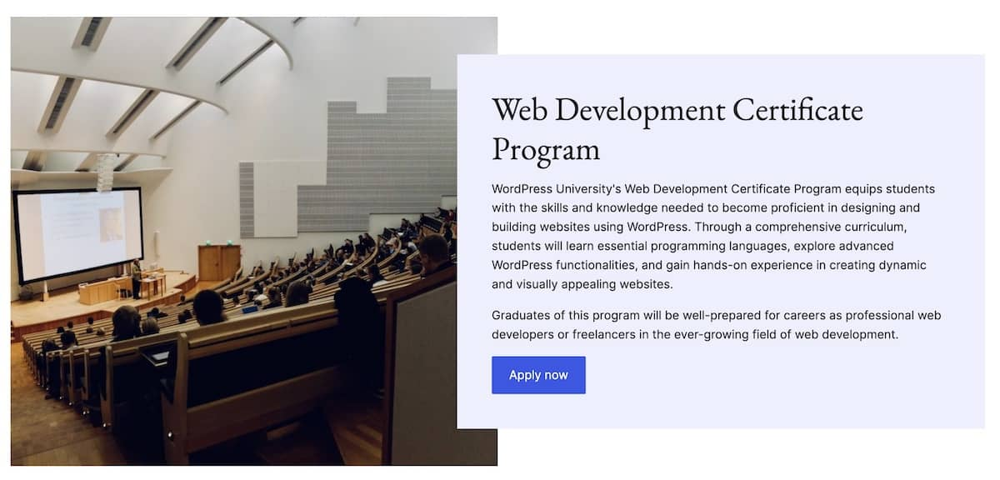

# Step 6: Block Styles

## Steps

### 1. 


```css
/* Modify Media & Text styling to use spacing presets. */
.wp-block-media-text {
    grid-gap: var(--wp--preset--spacing--40);
}

.wp-block-media-text .wp-block-media-text__content {
    padding: 0;
}
```

```css
/* Add the text overlay block style to Media & Text blocks. */ 
@media (min-width: 600px) {
    .wp-block-media-text.is-style-text-overlay .wp-block-media-text__content {
        background-color: var(--wp--preset--color--tertiary);
        margin-left: -100px;
        margin-top: 50px;
        margin-bottom: 50px;
        padding: var(--wp--preset--spacing--40);
    }

    .wp-block-media-text.is-style-text-overlay.has-media-on-the-right .wp-block-media-text__content {
        margin-left: 0;
        margin-right: -100px;
        z-index: 1;
    }  
}
```
## Resources
- 

---
[← Previous](/steps/step-5/readme.md) &nbsp;&nbsp;|&nbsp;&nbsp; [Next →](/steps/step-7/readme.md)