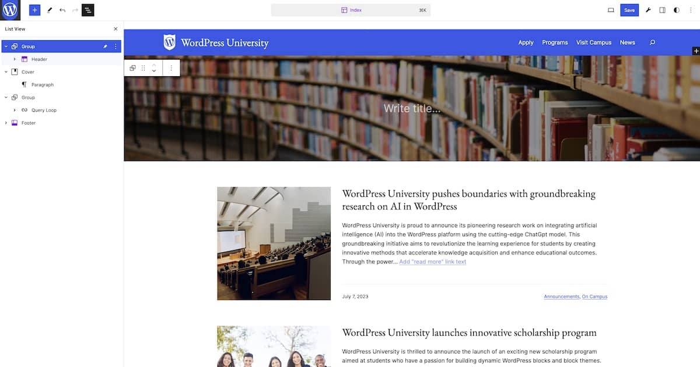
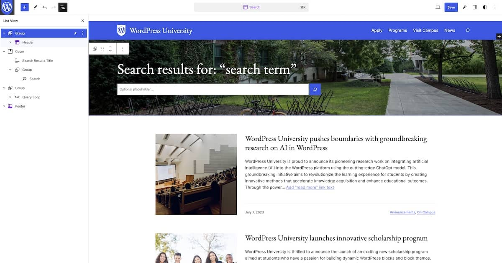
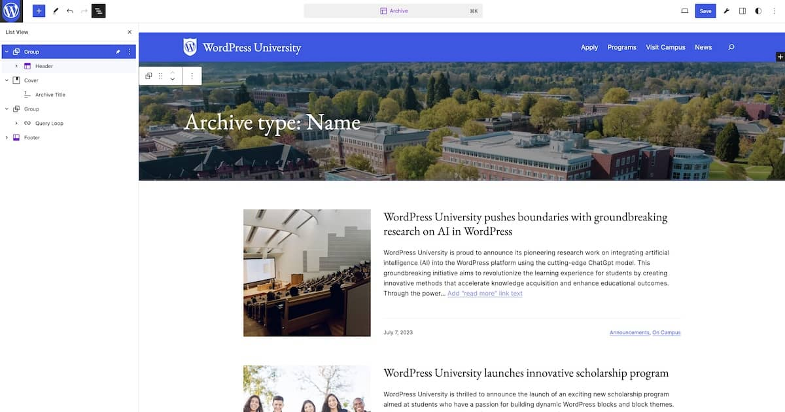

# Step 8: Templates & Template Parts

## Steps

### 1. Configure the Header and Footer template parts

1. Access the Site Editor by navigating to **Appearance → Editor**.
2. Click on "Library" and then select "Headers" if not already selected. 
3. Select and edit the Header by click on the pencil icon or the canvas.
4. In a new tab, navigate to the "Design" page, which was created earlier.
5. Copy the header design and paste it into the Header template part, replacing all existing content.
6. Save the Header and confirm that the website's header has now been updated on the front end.
7. Repeat the same process for the Footer.

### 2. Configure the Front Page template


1. In the Site Editor, navigate to "Templates".
2. Click on the ＋ icon to add a new template and select 'Front Page".
3. In the pattern modal that pops up, choose "Skip".
4. Add the Header and Footer template parts to the template.
5. In a new tab, navigate to the "Design" page, which was created earlier.
6. Copy and paste the site banner and University News designs into the Front Page template.
7. Copy and paste the text overlay card. Do this twice.
8. The final layout should be:
    - Header
    - Site banner
    - Text overlay card (image on left)
    - Text overlay card (image on right)
    - University News
    - Footer
9. Save the template.

### 3. Make the Header template part "sticky"

1. In the Front Page template, wrap the Header template part in a Group block.
2. In the block settings sidebar, in the Position panel, select "Sticky". The site header will now stick to the top of the page on scroll.
3. Set the Header template part to full width.
4. Repeat the same process for all templates on the site.
5. Save the template.

### 4. Configure the Home template


1. Navigate to the Home template in the Site Editor.
2. Remove all content between the sticky header and the Footer template part.
3. In a new tab, navigate to the "Headers" page, which was created for you.
4. Copy the "Page Header" design and paste it below the sticky header. 
5. Replace the Site Title block in the Cover with a Heading block set to `h1`.
6. Add the title "University News".
7. In a new tab, navigate to the "Query Loops" page, which was created for you.
8. Copy the "Home (Blog page) Query" design and paste it below the page header.
9. Save the template.

### 5. Configure the Index template


1. Navigate to the Index template in the Site Editor.
2. Remove all content between the sticky header and the Footer template part.
3. In a new tab, navigate to the "Headers" page, which was created for you.
5. Copy the "Page Header" design and paste it below the sticky header. 
5. Remove the Site Title block. There will be not title in this template.
6. In a new tab, navigate to the "Query Loops" page, which was created for you.
7. Copy the "Default Query" design and paste it below the page header.
8. Save the template.

### 6. Configure the Search template


1. Navigate to the Search template in the Site Editor.
2. Remove all content between the sticky header and the Footer template part.
3. In a new tab, navigate to the "Headers" page, which was created for you.
4. Copy the "Search Header" design and paste it below the sticky header. 
6. In a new tab, navigate to the "Query Loops" page, which was created for you.
7. Copy the "Search Query" design and paste it below the search header.
8. Save the template.

### 7. Configure the Archive template


1. Navigate to the Archive template in the Site Editor.
2. Remove all content between the sticky header and the Footer template part.
3. In a new tab, navigate to the "Headers" page, which was created for you.
4. Copy the "Archive Header" design and paste it below the sticky header. 
6. In a new tab, navigate to the "Query Loops" page, which was created for you.
7. Copy the "Default Query" design and paste it below the archive header.
8. Save the template.

### 8. Configure the Page template


1. Navigate to the Page template in the Site Editor.
2. Remove all content between the sticky header and the Footer template part.
3. In a new tab, navigate to the "Headers" page, which was created for you.
4. Copy the "Page Header" design and paste it below the sticky header. 
5. In the block toolbar of the Cover block, click "Replace" and then choose "Use featured image".
6. Below the page header, add a Group block with "Inner blocks use content width" disabled.
7. Inside of the Group, add the Post Content block and make sure "Inner blocks use content width" enabled.
8. Save the template.

### 9. Configure the Single template


1. Navigate to the Page template in the Site Editor.
2. Inside of the Group block between the sticky header and the Footer template part, remove everything except the Post Content block and the Comments template part.
3. In a new tab, navigate to the "Headers" page, which was created for you.
4. Copy the "Post Header" design and paste it above the Post Content block. 
5. In a new tab, navigate to the "Footers" page, which was created for you.
6. Copy the "Post Footer" design and paste it below the Post Content block. 
8. Save the template.

### 10. Save changes to the theme
1. In the canvas of the Site Editor. click on the wrench icon in the top right, this will open the Create Block Theme panel.
2. Click “Save Changes” to apply all modifications to the theme itself.
3. **Note, this will create a few errors.**

### 11. Fix minor Create Block Theme bugs
1. In the theme files, investigate the `/templates`, `/pattern`, and `/parts` folders to confirm that the modifications have been applied.
2. Notice that some templates are referencing a pattern, while others have the complete block markup.
3. In all patterns that include a template part, add the attribute `"theme":"wpuniversity"` to the `<!-- wp:template-part { ... } -->` markup. Here is an example for the Header template part:
```html
<!-- wp:template-part {"slug":"header","tagName":"header","theme":"wpuniversity"} /-->
```
4. There is a minor bug in the way the Create Block Theme plugin manages Media & Text blocks. In the `front-page.html` pattern, replace line 33 with:
```html
<div class="wp-block-media-text alignwide is-stacked-on-mobile is-vertically-aligned-center is-image-fill is-style-text-overlay" style="margin-top:var(--wp--preset--spacing--50);margin-bottom:var(--wp--preset--spacing--50)"><figure class="wp-block-media-text__media" style="background-image:url(<?php echo esc_url( get_stylesheet_directory_uri() ); ?>/assets/images/lecture-hall-1024x768.jpg);background-position:50% 50%">/assets/images/lecture-hall-1024x768.jpg" alt="" class="wp-image-41 size-full"/></figure><div class="wp-block-media-text__content"><!-- wp:heading {"style":{"spacing":{"margin":{"top":"0","bottom":"0"}}},"fontSize":"x-large"} -->
```
5. In the `front-page.html` pattern, replace line 61 with:
```html
<!-- /wp:buttons --></div><figure class="wp-block-media-text__media" style="background-image:url(<?php echo esc_url( get_stylesheet_directory_uri() ); ?>/assets/images/campus-1-1024x768.jpg);background-position:50% 50%">/assets/images/campus-1-1024x768.jpg" alt="" class="wp-image-224 size-full"/></figure></div>
```
6. Navigate back to the Site Editor. Confirm that each template is now appearing correctly.

---
[← Previous](/steps/step-7/readme.md) &nbsp;&nbsp;|&nbsp;&nbsp; [Next →](/steps/step-9/readme.md)